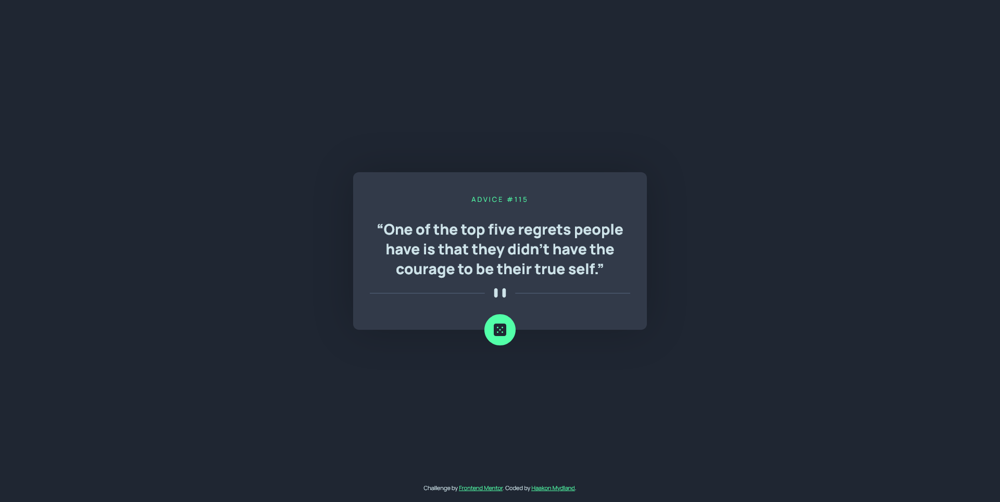

# Frontend Mentor - Advice generator app solution

This is a solution to the [Advice generator app challenge on Frontend Mentor](https://www.frontendmentor.io/challenges/advice-generator-app-QdUG-13db). Frontend Mentor challenges help you improve your coding skills by building realistic projects.

## Table of contents

- [Overview](#overview)
  - [Screenshot](#screenshot)
  - [Links](#links)
- [My process](#my-process)
  - [Built with](#built-with)
  - [What I learned](#what-i-learned)
- [Author](#author)

## Overview

### The challenge

Users should be able to:

- View the optimal layout for the app depending on their device's screen size
- See hover states for all interactive elements on the page
- Generate a new piece of advice by clicking the dice icon

### Screenshot




### Links

- Solution URL: [Add solution URL here](https://your-solution-url.com)
- Live Site URL: [Add live site URL here](https://your-live-site-url.com)

## My process

### Built with

- Semantic HTML5 markup
- CSS custom properties
- Flexbox
- Mobile-first workflow
- Fetch Api
- [React](https://reactjs.org/) - JS library

### What I learned

This is a pretty simple a example of accessing a third-party api. The advice and advice id is manged in a react state and the dom elements updates based on state.

This is how i update the state, I'm gussing there is a better way to do it.

```tsx
function getAdvice() {
  fetch("https://api.adviceslip.com/advice")
    .then((response) => response.json())
    .then((data) => setAdviceWrapper(data));
}
function setAdviceWrapper(data: object) {
  setAdvice((prev) => {
    return [data.slip.id, data.slip.advice];
  });
}
```

Most of the css is scoped to the component itself

```tsx
import style from "./Card.module.css";
```

```tsx
<h2 className={style.title}>Advice #{advice[0]}</h2>
<h1 className={style.advice}>“{advice[1]}”</h1>
```

## Author

- Website - [Haakon Mydland](https://www.haakonmydland.com/home)
- Frontend Mentor - [@haakonmydland](https://www.frontendmentor.io/profile/haakonmydland)
- Twitter - [@haakonmydland](https://www.twitter.com/haakonmydland)
